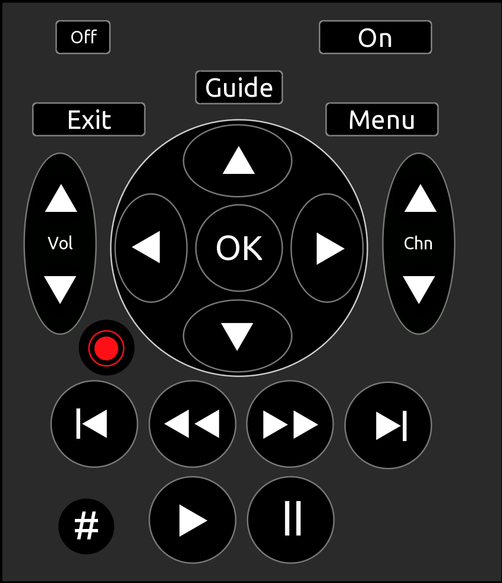

# Infrared Remote UI for Logitech Harmony Hub

This is a proof-of-concept UI for a [Logitech Harmony Hub](https://support.myharmony.com/en-us/hub). Even though Logitech has officially discontinued the sale of this product, it remains one of the most popular universal remote control solutions, particularly well suited for integration with home automation systems. For security reasons, the XMPP remote feature on the hub is disabled by default and therefore must be enabled for remote control to work. This is be done from the Harmony app. Go to: **Menu > Harmony Setup > Add/Edit Devices & Activities > Remote & Hub > Enable XMPP**.

The TouchOSC template sends custom [OSC, Open Sound Control](https://ccrma.stanford.edu/groups/osc/index.html) messages to a message handler running in [Node-RED](https://nodered.org/) on a [Raspberry Pi 3B](https://www.raspberrypi.org/computers). The handler then sends command requests to the hub. The command requests are sent using the [Harmony Command node](https://flows.nodered.org/node/node-red-contrib-harmony-extra).

## The TouchOSC Template ([ir_remote.tosc](ir_remote.tosc))



The template is meant to be a simple layout that is easy to use, particularly in low-light situations.

Note that the entire remote is a group. This is because it is a sub-project for a much larger 4K wall-mounted control panel. I also make heavy use of element grouping to keep things aligned and easier to move around without having to be too concerned with messing up alignment.

Each button is a group made up of three objects; a background, a button, and a label. Each button has a single OSC message that is sent when the button is pressed. There is a bit of scripting on the buttons for visual confirmation of a press. If the device supports it, this would be a good place to put a call to the vibrate function for a more tactile confirmation. There is also a bit of scripting on the "#" button that makes the "popup" number pad visible.

The format of the custom OSC messages is as follows:

```lua
/<instance>/<location>/<device>/<command>
```

For this template the address is:

```lua
/hs4b/backoffice/tivo/<command>
```

For the number pad keys, the OSC message is:

```lua
/hs4b/backoffice/tivo/numpad
```

With the argument of the message containing the actual key value as a string. As you can see in the Node-RED flows, the 'numpad' message along with its argument is passed to a secondary switch handler, since the number pad is only occasionally used.

## The Node-RED Message Handler Flows

 The TouchOSC Receiver is straight-forward. A UDP listener node listens for TouchOSC OSC messages on port 8000. Of course, this port can be changed simply by editing the node. The UDP message is sent to an [OSC decode node](https://flows.nodered.org/node/node-red-contrib-osc) where it is decoded into a Node-RED message containing topic and payload. The message is then passed to a switch node that acts as a router, based on the start of the address of the message. A regex match of the start of the OSC address is done and the message is passed along. Messages not starting with the proper address are simply discarded, after being logged, of course. As mentioned above, this will be part of a larger TouchOSC project.

([TouchOSC_Receiver.json](TouchOSC_Receiver.json))


A message with a validated starting address is passed to another switch node that looks for a regex match at the end of the OSC address, which is the actual command.  Each of those matches directs the message to the corresponding Harmony Command node, which triggers a Hub command request. Any command not matched by the switch node is logged and discarded.

([TiVo_Switch.json](TiVo_Switch.json))


In the case of the 'numpad' command, the message is passed to a secondary switch that looks at the message argument and then triggers the corresponding Harmony Command node. Again, logging and discarding invalid key arguments.

([TiVo_NumPad.json](TiVo_NumPad.json))


