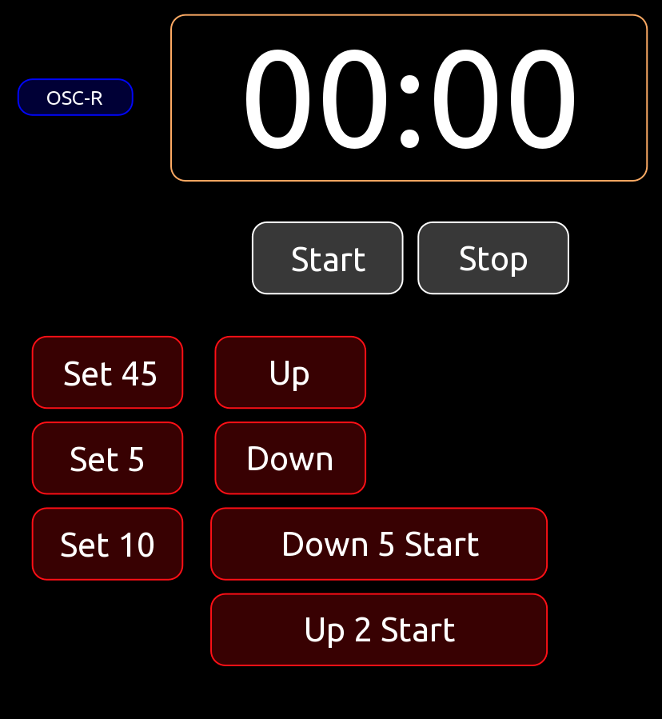

# A General Purpose Up/Down Timer With Optional OSC Remote Control

## The Display

A majority of the work is done by the script code in the 'display' label. All aspects of the timer are controlled using the notify function to the 'display'.

The following notify actions are supported:

- set - Set the timer value in minutes (ignored if timer is running)
- direction - Set the Up/Down direction (ignored if timer is running)
- start - Start the timer
- stop - Stop the timer
- stat - Send current timer status to OSC remote

## OSC-R (OSC Remote)

This is the OSC remote control handler that recieves OSC messages and turns them into notify calls to 'display'.  It also sends the optional timer status back to the OSC remote controller. In a real template, this object can be hidden.

/timer/set i  

/timer/direction up|down  

/timer/start  

/timer/stop  

/timer/stat  

## The Buttons

The buttons in this template are just examples of how the timer display can be controlled locally. If the OSC remote funcationality is used, these are not needed.

Each button sends 1 (or more) notify commands to the display to set and control the timer.
