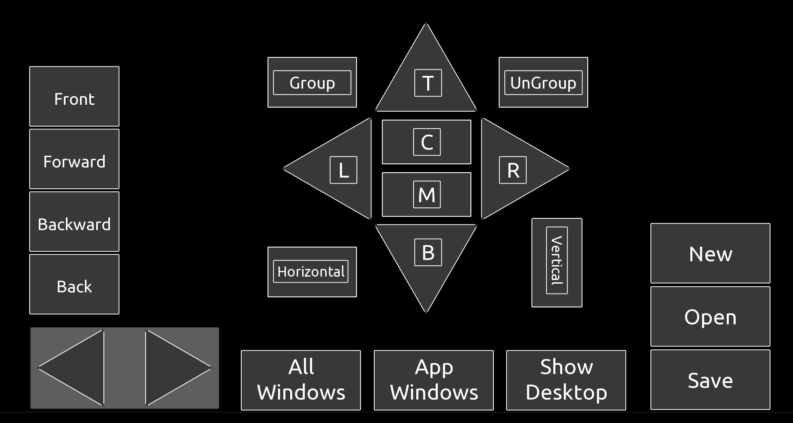

# A TouchOSC Editor Shortcut Template for Mac and Windows (Work-In-Progress)

This template was inspired by this [Tim Corpus tutorial](https://www.youtube.com/watch?v=3cGqrWCayDc) on how to use [TouchOSC mk2](https://hexler.net/touchosc) and [TouchOSC Bridge](https://hexler.net/touchosc#resources) to send keystrokes to a Mac or Windows PC.



To configure the template for Mac or Windows, you only need to edit one variable in the document root init() script function.

```lua
function init()

  platform = 'Mac' -- Set to 'Mac' or 'Windows'
  ```
  
## To use the template

  1. Run TouchOSC Bridge on your desktop editor computer.
  2. On your tablet, run TouchOSC and open Connections.
  3. Create a new OSC connection to your desktop and set the Send port to 12101. Leave the Receive port blank.
  4. On the desktop, start the editor network as the server.
  5. On the tablet, connect to the editor network as a client.
  6. This should deploy the template to your tablet.
  7. Disconnect from the editor network and save the template.
  8. Play the template.

  Enjoy. Please feel free to make suggestions as this is a work-in-progress.

## How it works

  Coming Soon
