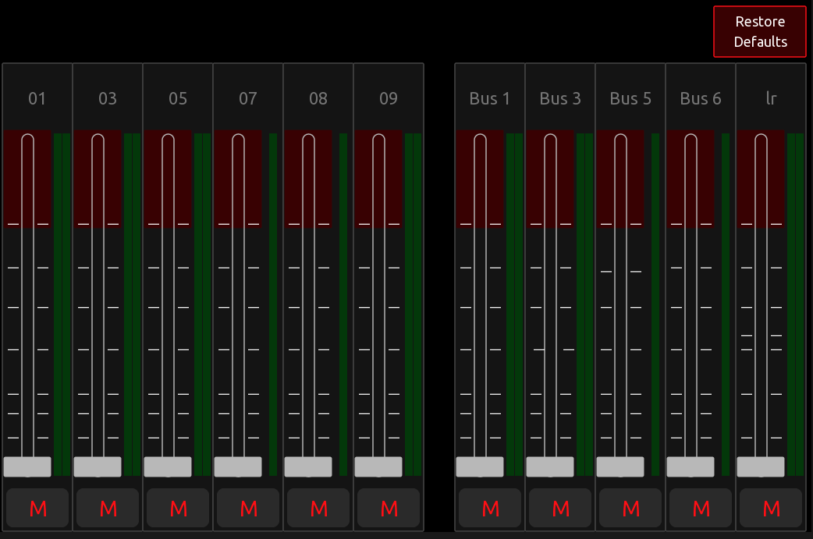
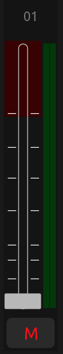

# A Modular, Customizable Mixer Template for the Behringer X/M-Air Digital Mixer

**IMPORTANT: When copying parts of this template it is critical to the scripting that the controls not be renamed. In TouchOSC, under Settings->Editor, make sure to uncheck "Assign new names on copy/paste".**

## Modular Design

Each channel strip is a group. There are different types of channels strips for input channels, bus channels, and for Main LR. Input and Bus channel strips can either be Mono or Stereo. For Stereo, only the Left fader is needed since the Left/Right channels are stereo linked. For metering, both channel meters are shown for stereo, but only the left meter is shown for mono.

Speaking of metering.  All metering is handled by a single control; a non-interacive, hidden box control, that receives and distributes meter values to the channel strips. More on that later.

## The Channel Strip

Channels strips can be duplicated as many times as needed with only the group 'tag' needing to be edited. The 'tag' property is the channel or bus number and needs to match Behringer's channel/bus format.

To clarify, 'tag' needs to be a 2-digit string with a leading zero, if applicatble.  For example channel 1 is '01', bus 1 is '1'. Main LR should not have to be changed. It is always 'lr'.

[Stereo Shown]

- Mute button

    The Mute button is a group in and of itself. It inherits its channel number from the channel strip group tag. The 'init' function of the button queries the mixer at startup to sync to the current mixer value. Some script code is used to handle color changes and to invert the button vs. OSC "mix/on" value.

- Fader

The fader is also a group of controls and inherits its channel number from the channel strip group 'tag'. The scale is non-interactive and in the background. For a bit more realistic visual effect, the front fader knob is wide, while the back fader control is narrow. The front fader updates the back fader value everytime it changes. The front fader also implements a 'limiter' so the fader can't be set above 75% or 0dB. Of course, the limiter can be disabled in the template.

- Meters

The meter displays are nothing more than narrow faders without a border and with the knob/cursor turned off. They are set by the meters_handler, but more on that later.

- Scribble Strip

The scribble strip is a text box that inherits its channel number from the channel strip group 'tag'. The text and color of the scribble strip is a mirror of what is set on the mixer, with the exception of not supporting the inverted colors. I just didn't feel the need to handle the inverted options, but if anyone wants to expand on that, I'd be happy to include it in the template.

## Restore Defaults (with Confirmation)

The 'Restore Defaults' button uses the notify function to "call up" or "make visible" a confirmation dialog. If the confirmation answer is 'Yes' then a True is returned to the button, which causes an OSC messages to be sent to the mixer to load snapshot 64. Of course, the snapshot number can be changed in the button script. This assumes the snaphot has previously be saved as the "Defaults'. If the confirmation answer is 'No', a False is returned, and the button simply ignores the returned value. In both cases, the confirmation dialog is hidden after a choice is made.

## Metering

Metering is handled entirely from a single, non-interactive, hidden box control named 'meters_handler'. Two OSC Receive messages are defined for the control; '/meters/1' and '/meters/5', although currently only '/meters/1' is being used.

The script code in this control MUST be modified to match the channel strips being used. This relies on the findByName function to find the channel strips, so the meter data can be distributed for each update. Also within the meters_handler is a function called dbToFloat. Since the 16-bit values coming from the mixer are dB values, they need to be scaled to the fader range of 0-1. The X/M-Air uses the same scaling as the X32, so this code is based on the C code written by Patrick-Gilles Maillot for the X32.

## Subscribing to Mixer Updates

In order to receive updates from the mixer, a periodic subscription request must be made at least once every 10 seconds. In addition, periodic meter data needs to be requested, so the meter values are refreshed. Both of these requests are sent from a small script running in the document root.
