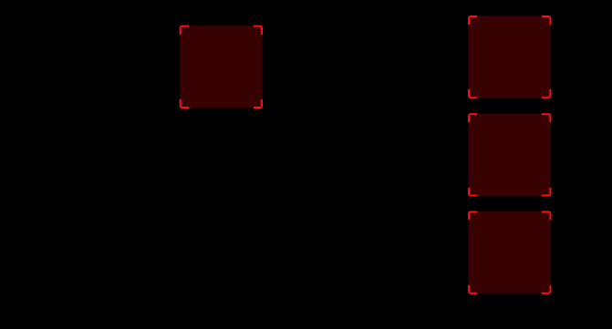
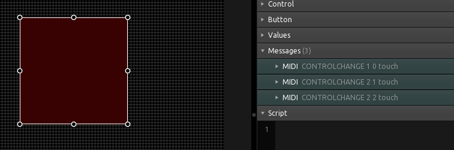
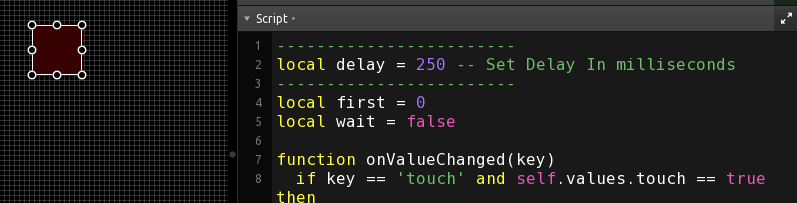
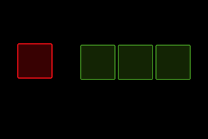
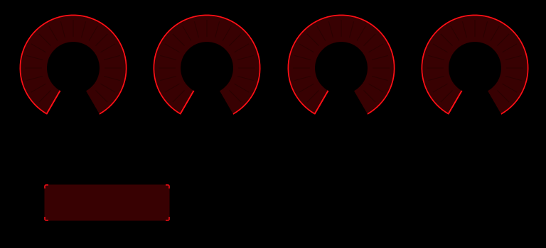
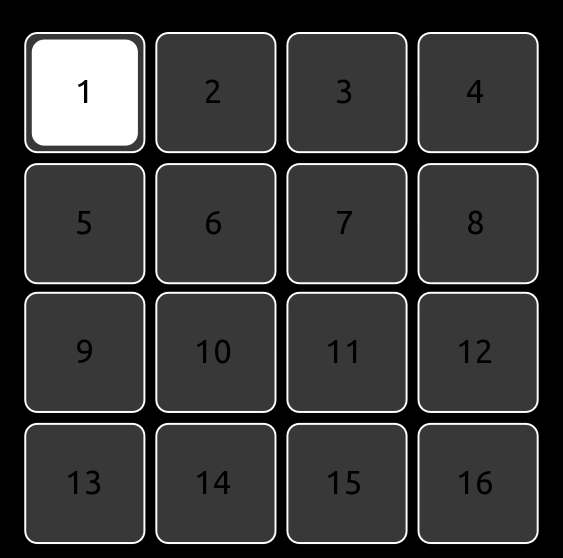
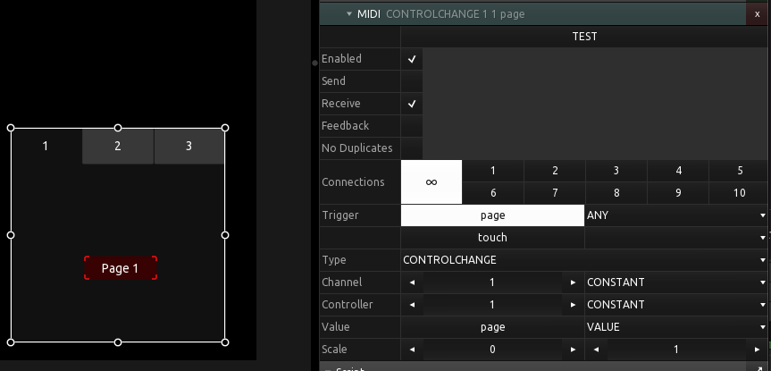
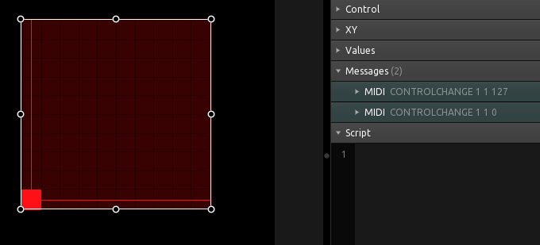

# Bite-Sized Examples, Each Showing A Different Concept

A collection of example templates, each showing a single, specific concept.

## 1-to-3_buttons

An example of how to use a single button to control the values of three other buttons at the same time.  Buttons 2-4 can be used individually while Button 1 sets them to the same state when pressed or released.

## 1in-2out

An example of how to receive a MIDI message and use it to trigger the sending of 2 other MIDI messages. A box control is used for the messages since no interacion is required. No scripting needed.

## 2midi-with-delay

An example of how to send a MIDI message when a button is pressed and then a second MIDI message after a specified period of time. It's common to need a delay between MIDI messages, particularly with older hardware.

## 3-to-1_buttons

An example of setting the state of one button based on the state of another group of three buttons.

- buttonA(red) is 0 if any groupB buttons(green) are 1  
- buttonA(red) is 1 if all groupB buttons(green) are 0

## ADSR_CC_Set

An example of how to change the MIDI CC# for a control using the 'TAG' property. When the button is unpressed, the radials are set to use CC# 1-4 and when the button pressed, they will use CC# 5-8. This could be further expanded to use a radio button control for more options.

## always_bright_button

An example of how to use two buttons to create a button that is always bright. The bright color is actually the back button while the front, tranparent button is the value control. All of the scripting work is done with from the front button.

## blinking_button

An example of how to use two buttons to create a button that blinks when pressed.  The blinking is actually the back button while the front, tranparent button is the value control. The front button uses the notify function to tell the back button when to start or stop blinking.

## CC_buttons_to_knob

An example of how to change the CC value of a MIDI message sent by a radial (knob). An exclusive button group is used to set the CC value in the radial 'tag' property.  The 'tag' property is used in the radial MIDI message.

V02: The radial values are now saved and restored when switching buttons (CC values). Note that the values are only saved while the template is running but not between sessions.

## exclusive_button_group

An example of how to create a button group where only one button is selected at a time. The advantage of this over a button grid control with exclusive mode enabled is the fact that each button can have its own unique messages, instead of just an 'x' value within the grid control. Another advantage of this method is the buttons don't need to be in any kind of a uniform pattern. They can be in a square pattern, or a circle, or a triangle, or whatever you wish.

## midi-after-delay

An example of how to send a delayed MIDI message. The message is sent after a delay when the button is released.

## pager_midi_switch

Use a MIDI message to switch pages of a pager. No scripting.

A MIDI CH01 CC#1 message is defined at the pager level with the data2 value set to the page number of the pager. Pages in a pager are ZERO based meaning that that start to count from 0, not 1.

## xy_touch

Send a MIDI message when an XY control is touched and a different messaage (or value) when it is released. No scripting.

In this example, a CH01 CC#1 with a data2 value of 127 is sent when the XY pad is touched, and a data2 value of 0 is sent when it is released. Each message, not just the value, could be different.

