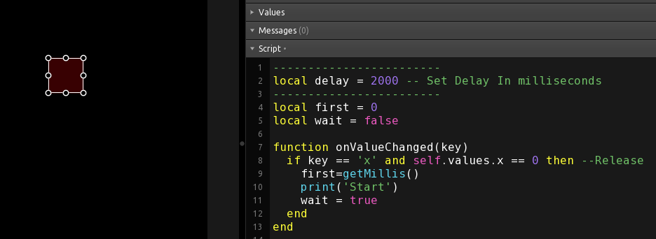

# Bite-Sized Examples, Each Showing A Different Concept

A collection of example templates, each showing a single, specific concept.

## 1-to-3_buttons

An example of how to use a single button to control thre values of three other buttons at the same time.  Buttons 2-4 can be used individually while Button 1 sets them to the same state when pressed or released.

## 1n-2out

An example of how to receive a MIDI message and use it to trigger the sending of 2 other MIDI messages. A box control is used for the messages since no interacion is required. No scripting needed.

## 2mid-with-delay

An example of how to send a MIDI message when a button is pressed and then a second MIDI message after a specified period of time. It's common to need a delay between MIDI messages, particularly with older hardware.

## 3-to-1_buttons

An example of setting the state of one button based on the state of another group of three buttons.

- buttonA(red) is 0 if any groupB buttons(green) are 1  
- buttonA(red) is 1 if all groupB buttons(green) are 0

## ADSR_CC_Set

An example of how to change the MIDI CC# for a control using the 'TAG' property. When the button is unpressed, the radials are set to use CC# 1-4 and when the button pressed, they will use CC# 5-8. This could be further expanded to use a radio button control for more options.

## always_bright_button

An example of how to user two buttons to create a button aht is always bright. The bright color is actually the back button while the front, tranparent button is the value control. All of the scripting work is done with from the front button.

## midi-after-delay

An example of how to send a delayed MIDI message. The message is sent after a delay when the button is released.

