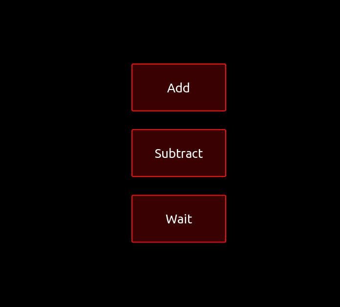
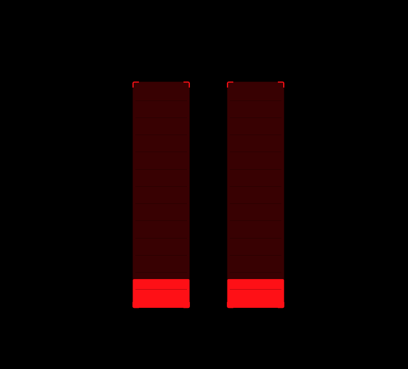
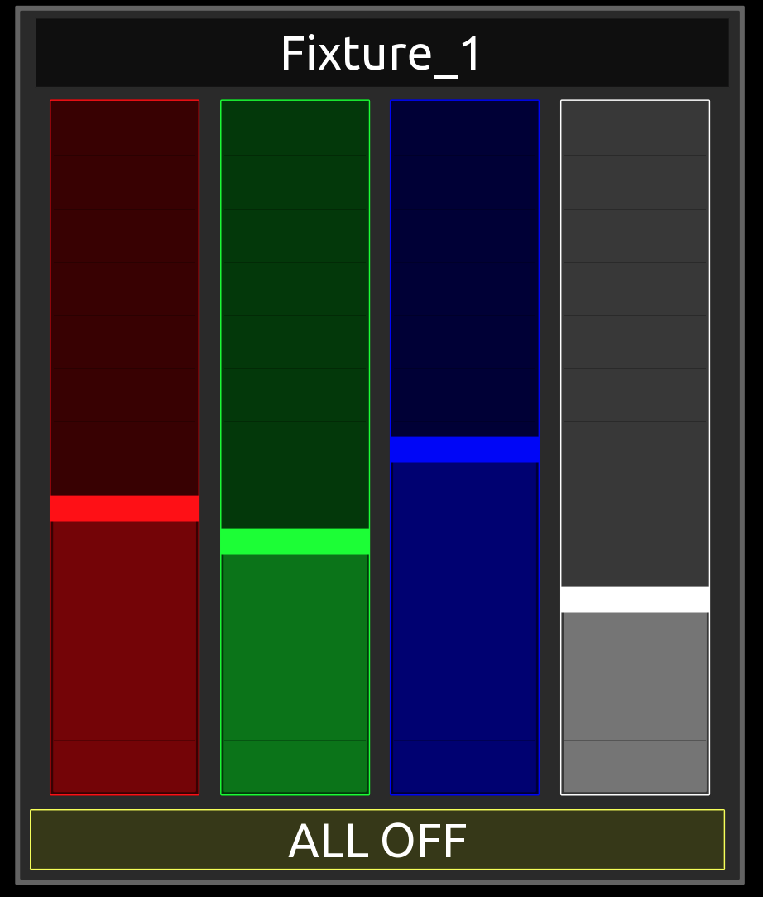
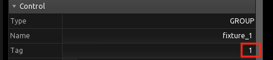
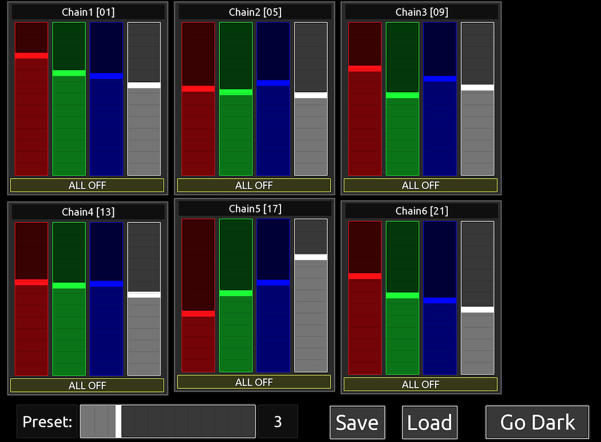

# Shared Scripts Examples

A small collection of example templates, each showing the concept of shared scripts.

## Simple Examples ([simple_example_v01.tosc](./templates/simple_example_v01.tosc))

An example of how a single shared script can contain multiple functions. Think of the shared script as a library of commonly used functions.



```lua
--
-- Shared Utility Functions
--

-- Add 'a' and 'b' and return the result
function add(a,b)
  return a + b
end

-- Subtract 'b' from 'a' and return the result
function sub(a,b)
  return a - b
end

-- Wait 'ms' milliseconds before returning
-- DO NO EXCEED 200mS or the script will timeout
function wait(ms)
  now = getMillis()
  while 1 do  
    expired = getMillis() - now
    if expired > ms then
      --print ("expired: ", expired)
      break
    end
  end
end
```

### Add Value 'a' and 'b'

The script on the "Add" button calls the 'add' function. Note the require statement that includes the shared script 'utils' into the button script.

```Lua
require('utils')

function onValueChanged(key)
  if key == 'x' and self.values.x == 1 then --Press
    local c = add(1,2)
  print(c)  
  end
end
```

### Subtract Value 'b' from 'a'

The script on the "Subtract" button calls the 'sub' function. Again, note the require statement.

```Lua
require('utils')

function onValueChanged(key)
  if key == 'x' and self.values.x == 1 then --Press
    local c = sub(1,2)
  print(c)  
  end
end
```

### Wait 'ms' millisends

Now for a pracitcal example. Many times there's a need to add a short delay between MIDI messages, particularly when sending to older equipment. This shows how easy it is to add that short delay and call it whenever needed.

To see this in action, open the Script tab in Log Viewer, click on the clockface icon in the upper-right to enable timestamps, and then press the button. You should see the 100mS delay between the 'Start' and 'End' print statements.

IMPORTANT NOTE: Set Script Timeout to 'Long' in Settings. If the 'ms' value is greater than 200mS, the script will cause a timeout error.

```Lua
require('utils')

function onValueChanged(key)
  if key == 'x' and self.values.x == 1 then --Press
    print('Start')
    wait(100)
    print('End')
  end
end
```

## MIDI Examples ([midi_example_v01.tosc](./templates/midi_example_v01.tosc))

A couple of examples using MIDI faders. In this template, there are three shared scripts. The 'conenctions' shared script is an example of how to define constants once and use them throughout your other scripts. The second script contains a scaling function that would be common use case.



The 'connections' shared script defines three tables that match the MIDI Connections tab. Think of these as constants that can be edited in one place.

```Lua
-- Connection #1
XR18 = {true, false}

-- Connection #2
Cholocate_Plus = {false, true, false}

--Connection #3
Pa700 = {false, false, true}
```

The 'scaling' shared script defines a function that scales a value of 0-1 to a new value of 0-64.

```Lua
--Scales a fader float from 0-1 to an int from 0-64
function scale64(val)
  return(math.floor(val*64))
end
```

The 14-bit MIDI Conversion shared script code was written by another user and shared on Discord.

```Lua
-- Thanks to @kirkwoodwest for this code
function convertFloatTo14bitMidi(value)
  -- Scale the float in the range 0-1 to a 14-bit value
  local value14bit = value * 16383
  local msb = math.floor(value14bit / 128)
  local lsb = math.floor(value14bit) % 128
  --print(msb..':'..lsb)
  return msb, lsb
end
```

### Scaling Example (Left Fader)

The default behaviour of a TouchOSC fader is to be a floating-point value between 0-1.  For MIDI, the default would be a value of 0-127. What if you only wanted 0-64 but still wanted to use the entire range of the fader? This is where shared scaling scripts can be useful.

```Lua
require('connections')
require('scaling')

function onValueChanged(key)
  if key == 'x' then
    sendMIDI({176, 0, scale64(self.values.x)}, Pa700)
  end
end
```

### Send 14-bit MIDI Messages from a fader (Right Fader)

Another common use case is to send 14-bit MIDI messages to control RPN or NRPN parameters. In this example, the fader is acting like a HUI fader.

```Lua
require('connections')
require('14-bit')

local zone = 1 -- Also known as fader number (0..7)

function onValueChanged(key)
  if key == 'x' then
    local dataMsb, dataLsb = convertFloatTo14bitMidi(self.values.x)
    --print(dataMsb..':'..dataLsb)
    sendMIDI({0xb0,0x00+zone,dataMsb}, Pa700)
    sendMIDI({0xb0,0x20+zone,dataLsb}, Pa700)
  end
end
```

Note that I do not own a Korg Pa700 to test so this fader may not work as expected. The Pa700 device in this example is just Protokol so I can see the messages being sent.

## An OSC Example ([AN-Fixture_v02.tosc](./templates/AN-Fixture_v02.tosc))

An example of a 4-channel ArtNet fixture controller using just three shared scripts.



Much like the MIDI example, we can mirror the TouchOSC OSC connections as constants so we only have to change them in one place if our network devices change.

```Lua
-- Set OSC Connections here
-- These MUST Match TouchOSC OSC Connections 
remoteOSC = { false, false, false, false, false, true }
```

The four faders use a single, shared script named 'channelHandler'.  The starting channel is set in the 'tag' property of the fixture group.



The channel 'offset' is set during init based on the name(color) of the fader.

```Lua
function init()
  if self.name == 'Red' then
    offset = 0
  elseif self.name == 'Green' then
    offset = 1
  elseif self.name == 'Blue' then
    offset = 2
  elseif self.name == 'White' then
    offset = 3
  end
end

function onValueChanged(key)
  if key == 'x' then
    address = '/artnet'
    channel = tonumber(self.parent.parent.tag) + offset
    value = math.floor(self.values.x * 255)
    --print(address..' '..value)
    -- /artnet <universe> <channel> <value>
    sendOSC({address, {{tag='i',value=0},{tag='i',value=channel},{tag='i',value=value},}},remoteOSC)
  end
end
```

Looking at this code again, I see that the 'address' and 'channel' assignments should be moved to the init function, instead of being set every time the fader is moved. Look for an update to this shortly.

Finally, the "ALL OFF" button uses a shared script named 'allOffHandler' to reset the fader values in the group.

```Lua
rgbw = self.parent.parent:findByName('rgbw', false)
--print(rgbw.name)
function onValueChanged(key)
  if key == 'x' and self.values.x == 1 then
    for i=1, #rgbw.children do
      rgbw.children[i].values.x = 0 
    end
  end
end
```

To show the true power and value of shared scripts, this is how simple the script code is within each fader.

```Lua
require('connections')
require('channelHandler')
```

The ALL OFF button script is even simpler. 

```Lua
require('allOffHandler')
```

### Finished (Almost) Template

The six fixtures or "chains" in this template are identical with the exception of the starting fixture address in the group 'tag' property and the text in the top label. All 24x faders use a single, shared script.  The "ALL OFF" buttons also use a single, shared script.



### **(Add Link to Full OSC-ArtNet-DMX Project)**
